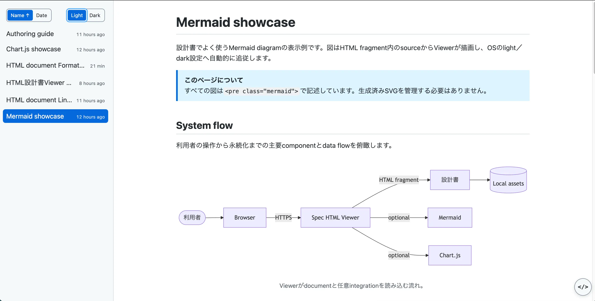
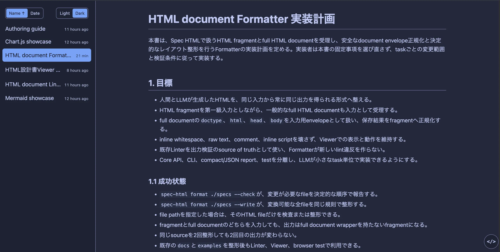
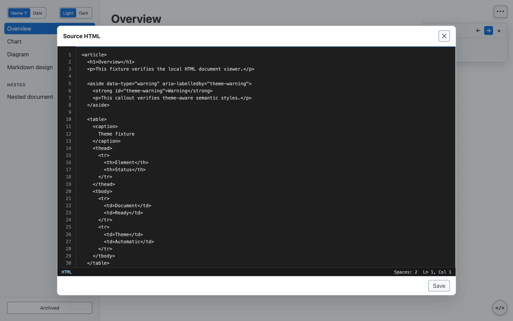

# Spec HTML

[English](./README.md) | 日本語

LLMが通常Markdownで生成する設計書や仕様書を、構造的なHTMLへ置き換えてローカルで読みやすく閲覧するためのViewerです。標準のsemantic HTMLを使うことで、Markdown以上の表現力を持つ文書を簡単に作成し、navigation、文書間リンク、画像、Chart.js、Mermaidを活用できます。



## Purpose and scope

Spec HTMLの目的は、LLMにWeb application一式を実装させることではありません。LLMに構造的なHTML fragmentを直接生成させ、見出し、table、code、callout、details、画像、図表など、Markdownだけでは表現しにくい情報を読みやすい設計書・仕様書として活用できるようにすることです。共通Viewerが表示とnavigationを整えるため、文書ごとにCSSやメニューを作る必要はありません。

Viewerと生成した文書は、手元の信頼済み環境で利用します。npm packageはCLIを配布するためのものであり、Spec HTMLを公開Web serviceにしたり、信頼できないHTMLを安全に実行したりするものではありません。

## Features

- content directory内のHTML fragmentからnavigationを自動構成
- content directory内の変更を検知してbrowserを自動reload
- 文書間の相対リンク、画像、browser historyに対応
- mobile向けnavigationとkeyboard操作に対応
- OS設定へ追従するlight／dark表示と文書印刷に対応
- content directory外へのpath traversalとsymbolic link escapeを拒否
- dotで始まるfile・directoryを非公開にし、全HTTP requestのHostを検証
- Chart.jsとMermaidはoptional dependency
- Mermaidは実行時に公式ES moduleを読み込むため、仕様変更時のSVG変換は不要
- HTML fragmentとfull HTML documentを決定的なfragmentへ整形するFormatter CLI
- 文書構造、参照、accessibilityを事前に検査するLinter CLI
- HTMLのtag名、attribute名、引用符、閉じtag、local参照の明白なTypoを修正するFixer CLI

## Requirements

- Node.js 20.19以上、22.16以上、または24以上
- Bun 1.3以上（CLIを`--bun`付きで実行）
- ローカルの信頼済みHTML

## Installation

設計書を置くprojectへSpec HTMLをinstallします。

```bash
npm install --save-dev spec-html
```

Chart.jsとMermaidも使う場合は、利用projectへ追加します。どちらか一方だけでも導入でき、未導入のintegrationは通常のHTML、CSS、画像、navigationへ影響しません。

```bash
npm install --save-dev chart.js mermaid
```

## Quick start

```text
specs/
├─ overview.html
├─ architecture.html
└─ assets/
   └─ diagram.svg
```

Viewerはdirectory内の`.html`を再帰的に読み取り、最初の`h1`を表示名とするnavigationを実行時に構成します。メニュー用fileを作成したりrepositoryで管理したりする必要はありません。起動中は指定directory配下だけを監視し、文書や画像を変更・追加・削除するとbrowserを自動reloadします。

各設計書はHTML document全体ではなく、`article`などから始まるfragmentとして保存します。

```html
<article lang="en">
  <h1>Authentication</h1>
  <p>Authentication is based on OpenID Connect.</p>
  
</article>
```

projectへinstallしたViewerを起動します。

```bash
npx spec-html ./specs
```

Bunでは同じpackageをinstallし、Node互換CLIをBun runtimeで実行するために`--bun`を指定します。

```bash
bun add --dev spec-html
bunx --bun spec-html ./specs
```

Viewerで開く前に、文書構造、参照、accessibilityを静的検査できます。通常は簡潔な診断を使い、修正方法が不明なruleだけ説明を表示します。

```bash
npx spec-html lint ./specs
npx spec-html lint ./specs --warnings-as-errors
npx spec-html lint --explain DOC001
```

HTML表層の明白なTypoを修正する場合はFixerを使います。`--check`はfileを変更せず、`--write`は有効な候補が1件だけの修正を適用します。`scritp`、`onclik`、`scr`、`herf`などの名前は修正しますが、`script`本文やevent handler属性値のJavaScriptは書き換えません。

```bash
npx spec-html fix ./specs --check
npx spec-html fix ./specs --write
```

HTMLのインデントと改行を統一する場合はFormatterを使います。`--check`はfileを変更せず、`--write`は変更が必要なfileだけを書き換えます。full HTML documentを渡した場合は、安全に無視できる`doctype`、`html`、`head`、`body`を除いてfragmentへ正規化します。headにstyle、script、link、baseがある場合は内容を失わないよう変換を拒否します。

```bash
npx spec-html format ./specs --check
npx spec-html format ./specs --write
```

Fixer、Formatter、Linterを一括実行する場合は`check`を使います。処理を指定しなければ、fileを書き換えずに3つ全てを確認します。`--fix`を付けるとFixerとFormatterの変更を適用してから、変更後のfileをLintします。組み合わせだけが必要な場合は処理を選択できます。

```bash
npx spec-html check ./specs
npx spec-html check ./specs --fix
npx spec-html check ./specs --fixer --lint
npx spec-html check ./specs --fixer --format --fix
```

普段使う場合は利用プロジェクトの`package.json`へ登録します。

```json
{
  "scripts": {
    "docs": "spec-html ./specs",
    "docs:fix": "spec-html fix ./specs --write",
    "docs:format": "spec-html format ./specs --write",
    "docs:check": "spec-html check ./specs",
    "docs:check:fix": "spec-html check ./specs --fix"
  }
}
```

詳しい記述規約、リンク解決、integrationの使い方は[日本語のAuthoring guide](./docs/authoring.ja.html)を参照してください。[英語版](./docs/authoring.html)もあります。

## AI agent向けの指示

次の指示を、利用projectの`AGENTS.md`へコピーしてください。content directoryが異なる場合は`specs/`を置き換えます。

```md
## Spec HTML文書

文書として残す価値のある設計判断・仕様・実装計画・調査結果は、別途文書化を指示されるのを待たず、`specs/`配下へSpec HTMLとして作成・更新する。内容に適した構成と表現を自ら選び、次を守る。

- 各fileは、文書の主言語を示す`lang`属性を持つ1つの`article`をrootにしたHTML fragmentとする。`html`、`head`、`body`、文書固有のCSS、navigationは作らない。
- `h1`は1つとし、標準のsemantic HTMLを使う。理解を助ける場合はtable、`aside`、`details`、`figure`を使う。
- 要件・結論・数値はHTML本文だけでも理解できるように書く。script、canvas、図は補助に限る。linkとassetは`specs/`内に置き、相対URLで参照する。

### Mermaid

導入済みで、flow、sequence、関係、構造が図の方が明瞭なら、個別の指示を待たず使う。複数行のsourceを`<figure><pre class="mermaid">…</pre><figcaption>…</figcaption></figure>`で囲み、初期化scriptや生成済みSVGは作らない。

### Chart.js

導入済みで、数値の比較、推移、構成比がchartの方が明瞭なら、個別の指示を待たず使う。`<figure><canvas id="…" aria-label="…"></canvas><figcaption>…</figcaption></figure>`とglobal `Chart`を呼ぶinline scriptを使い、正確な値は本文かtableにも残す。

### 検証

- 文書の作成・編集後は`npx spec-html check ./specs --fix --warnings-as-errors`を実行し、残る診断を解消する。
```

## Appearance

Sidebar上部の「Name」「Date」で、各directory内の文書を名前順または更新日順に並び替えられます。選択中のボタンをもう一度押すと、昇順と降順が反転します。「Light」「Dark」からは表示themeを選択でき、選択内容はbrowserへ保存されます。初回表示ではOS設定に合うthemeを使用します。Shell、文書、Chart.js、Mermaidは同時に切り替わり、dark表示は[Tokyo Night Storm](https://github.com/folke/tokyonight.nvim)を参考にした青みのあるpaletteです。Sidebar幅を超える文書タイトルは末尾を省略表示し、hover時のtooltipで全文を確認できます。



見出し、list、table、code、blockquote、details、figureなどのsemantic HTMLには既定styleが適用されます。`aside`はnote表示になり、`data-type`へ`warning`、`danger`、`success`を指定できます。

```html
<aside data-type="warning" aria-labelledby="migration-warning">
  <strong id="migration-warning">注意</strong>
  <p>この変更にはdatabase migrationが必要です。</p>
</aside>
```

画面右下のsource buttonから、現在の文書のHTMLをdialogで確認できます。描画結果とLLMが生成したsourceを同じ画面で見比べられます。



印刷時はSidebarとmobile menu buttonを除外し、現在の文書をlight配色で印刷します。

## Chart.js

`chart.js`が導入されている場合、通常のChart.jsコードをinline scriptで使用できます。

```html
<canvas id="latency-chart" width="320" height="180" aria-label="P95 latency chart"></canvas>
<script>
  const canvas = document.getElementById("latency-chart");
  new Chart(canvas, {
    type: "line",
    data: {
      labels: ["2.1", "2.2", "2.3"],
      datasets: [{ label: "P95", data: [180, 220, 230] }]
    }
  });
</script>
```

## Mermaid

`mermaid`が導入されている場合、`.mermaid`要素を自動描画します。初期化scriptやSVGへの事前変換は不要です。公式ES moduleと現在の図種に必要なchunkだけを読み込みます。

```html
<pre class="mermaid">
sequenceDiagram
  Browser->>API: Login
  API-->>Browser: Session
</pre>
```

## CLI

```text
spec-html [directory] [options]

--host <host>                  listenするhost（既定: 127.0.0.1）
--allowed-host <hostname>      非loopbackで許可するHost（repeat可、wildcardでは必須）
--port <port>                  listenするport（既定: 4173、0で自動割り当て）
--open                         起動後にbrowserを開く（既定）
--no-open                      browserを開かない
--help                         helpを表示
--version                      versionを表示

spec-html lint [directory] [options]
spec-html format [path] --check|--write [options]
spec-html fix [path] --check|--write [options]
spec-html check [directory] [--fix] [options]
```

## Security model

Spec HTMLはローカルの信頼済みHTMLを対象にします。設計書内のinline scriptは実行されるため、第三者から受け取ったHTMLを確認せずに開かないでください。

不慣れな文書へFixerを使う場合は、先に`--check`で変更を確認してください。`scritp`や`onclik`の訂正は対応するHTMLの動作を意図どおり有効にしますが、JavaScript source自体は変更しません。

既定では`127.0.0.1`だけで待ち受けます。loopback bindで許可するHTTP Hostは`127.0.0.1`、`localhost`、`::1`だけです。具体的な非loopback bindでは、repeat可能な`--allowed-host <hostname>`を追加できます。`--host 0.0.0.0`のようなwildcard bindには1件以上の指定が必須です。この設定を使っても、信頼できないnetworkへ公開しないでください。cross-originの文書状態更新も拒否します。

content directory外を指すpath traversalとsymbolic linkは配信しません。名前が`.`で始まるfileとdirectoryは、percent encodeされた場合もcontent routeから配信しません。

## v0.1 limitations

- 検索、Markdown変換は含みません。
- Formatterはsemantic tag、alt、caption、見出しなど意味判断が必要な内容を自動修正しません。
- Fixerは文章やJavaScriptを修正せず、HTMLの修正候補が複数ある場合は推測しません。
- browser自動テストはChromiumで全件、FirefoxとWebKitで重要導線のsmoke testを実行します。
- Node.js 24未満はサポートしません。

## Development

開発環境の構築、検証command、変更時のchecklistは[CONTRIBUTING.ja.md](./CONTRIBUTING.ja.md)を参照してください。release手順は[RELEASING.ja.md](./RELEASING.ja.md)、変更履歴は英語版のみの[CHANGELOG.md](./CHANGELOG.md)にあります。

## License

[MIT License](./LICENSE) © 2026 Spec HTML contributors
