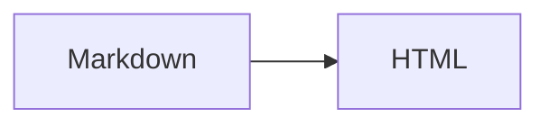

# Markdown design

This fixture verifies **Markdown preview** with a [relative HTML link](./overview.html#details).

```mermaid
flowchart LR
  Markdown --> HTML
  click HTML call markdownMermaidCallback()
```

[Unsafe link](javascript:window.markdownUnsafeLinkExecuted=true)
